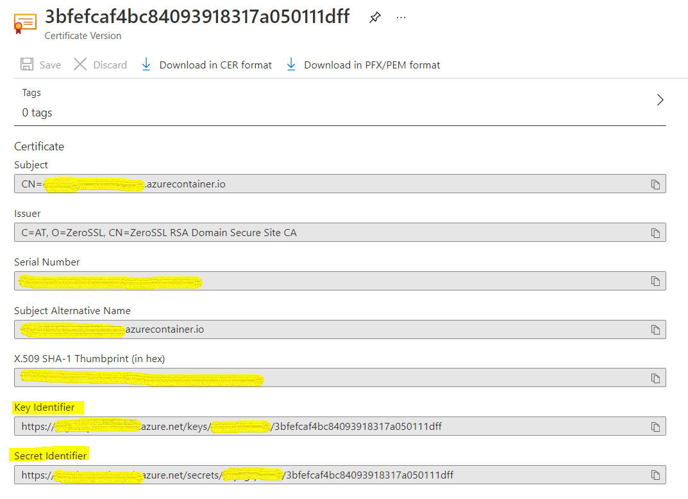
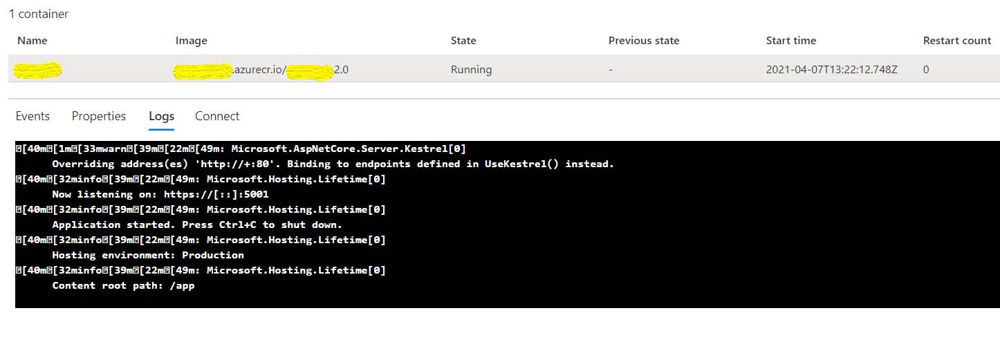
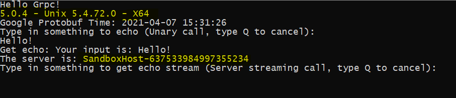

# Host ASP.NET Core Grpc service via Azure Container Registry

Recently I've been looking into running ASP.NET Core Grpc service on Azure. Sadly Azure App Service does not support hosting Grpc service [at this moment](https://feedback.azure.com/forums/169385-web-apps/suggestions/40585333-grpc-support-in-azure-app-service) and Azure VM is not what I'm looking for neither. So the option I have is to containerized the Grpc service and host it via Azure Container Registry and run it with Container Instances.

## Manage SSL Certificate
We want to manage the server side SSL certificate for Grpc service in a central place, so Azure Key Vault is an idea choice. Make sure you have the **pfx** format certificate and upload it to your key vault certificates. Assuming the Subject is matching to the container FQDN: **xxxx.xxxx.azurecontainer.io**

Note that once it's uploaded, it will generate a Secret Identifier and a Key Identifier for the same certificate version.



## Configure Kestrel
It's more convenient to configure Kestrel in code than in appsettings.json. Especially if you want to take advantage of Azure App Configuration and Azure Key Vault.

Specify Key Vault uri in **appsettings.json**

```json
   "AzKv": {
      "Uri": "https://xxxx.vault.azure.net/",
      "CertSecretName": "YOUR_CERT_NAME"
   }
```
The CertSecretName comes from the Secret Identifier generated after uploading the certificate.
```
https://<VaultName>.vault.azure.net/secrets/<CertSecretName>/<Version>
```

Make following changes in **Program.cs** to tell Kestrel only listen on HTTPS and tell it well to find the certificate.

```c#
public static IHostBuilder CreateHostBuilder(string[] args) =>
         Host.CreateDefaultBuilder(args)
             .ConfigureWebHostDefaults(webBuilder =>
                                       {
                                          webBuilder.UseStartup<Startup>().ConfigureKestrel(ConfigKestrel);
                                       });

private static void ConfigKestrel(KestrelServerOptions kestrelOpt)
{
   kestrelOpt.ListenAnyIP(5001, ConfigureListen);
}

static void ConfigureListen(ListenOptions listenOpt)
{
         //Kestrel need a ssl cert with private key, try to download it as secret.
         //Once pfx is loaded as Certificate, it will generate a secret as well
         var kvClient = new SecretClient(new Uri(m_Config.GetValue<string>("AzKv:Uri")), new DefaultAzureCredential());
         var cert = kvClient.GetSecret(m_Config.GetValue<string>("AzKv:CertSecretName")).Value.Value;

         listenOpt.UseHttps(new X509Certificate2(Convert.FromBase64String(cert)));
}
```
Please note that we are fetch the certificate as a secret, rather than a certificate. It's because if you fetch it as certificate, it won't contain the private key part. Here's a nice article explains this:

https://azidentity.azurewebsites.net/post/2018/07/03/azure-key-vault-certificates-are-secrets

Alternatively, you can setup Kestrel to use HTTP during development and only HTTPS when it's deployed to test or product. 

## Push the Image

Now we basically have everthing to support the Grpc service to run. You can now build the docker image of the service and push it to your Azure Container Registry.

```bash
docker push ACR_NAME.azurecr.io/YOUR_GRPC_IMAGE:Tag
```

Once it's done, you can bring up a container instance via Container instances, with FQDN FQDN: **xxxx.xxxx.azurecontainer.io**

You can also automate this part by Azure CLI or powershell.

## Enable Managed Identity for Container
Since we are storing the certificate in Key Vault, so you need to assign the managed identity to the container, and also assign the permission of reading from Key Vault secret to it. You can decide to use System assigned or User assigned Identity based on your scenario. (Currently Managed Identity for Container is under preview)

Now all the setup is done. Bring up the container instance, go to Logs, you should be able to see your ASP.NET Core Grpc service is running.


## Setup the Grpc Client
In your Grpc client, establish the channel against the container FQDN
```c#
using var channel = GrpcChannel.ForAddress(@"https://xxxx.xxxx.azurecontainer.io:5001");
var client = new TestService.TestServiceClient(channel);
```
Run the client, you should be able to access the Grpc services running in Azure container instances.


Please note now the client shows the server is running on a Unix box, as the container is a Linux one. And the server name is **SandboxHost-637533984997355234**

You can find the source code of the Grpc service here: https://github.com/cyang0513/ChyaGrpcSvr


